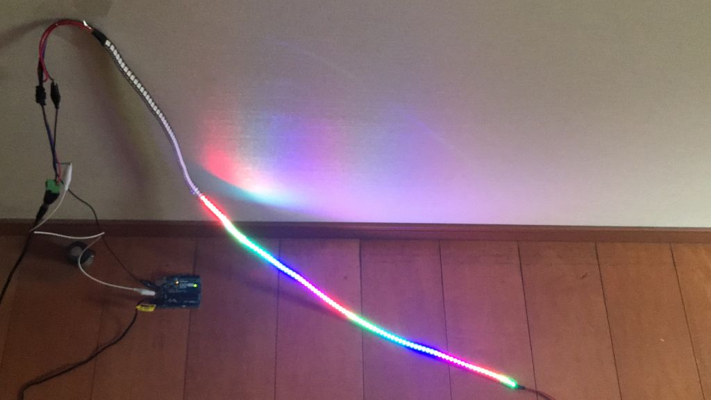

# 跳ねるLEDアニメーション
市販のLEDテープのデモンストレーションがつまらないので、楽しめるアニメーションを作りました。  
WS2812B搭載Adafruit NeoPixel互換LEDテープをArduino UNOやRaspberry Pi Pico、PICマイコンで制御します。  
Raspberry Pi Pico向けBASICシステムMachiKania type P用も追加しました。  

ArduinoではArduino IDEにNeoPixel用のライブラリを追加し、スケッチ「LED_bouncing.ino」をコピーしてご利用ください。  
  
Raspberry Pi Picoでは https://github.com/benevpi/pico_python_ws2812b からダウンロードした「ws2812b.py」をThonnyなどでRaspberry Pi Pico本体に保存し、「LED_bouncing_Pico.py」を実行してください。  
  
PIC16F18313ではpic16f18313ディレクトリ以下のファイルをMPLAB X IDEのプロジェクトに追加し、XC8コンパイラを指定してビルドしてください。HEXファイルも公開しました。  
Microchip Code Configuratorを使用したのでファイル数が多くなっていますが、全て必要です。VDD、GND、RA5以外のピンには何も接続しないでください。  
  
MachiKania type PではLIBディレクトリにWS2812Bクラスがあることを確認してください。  

LEDの総数、1ブロックの長さ、重力加速度、跳ね返り係数などのパラメータは変更可能です。  

動画はこちら https://youtu.be/mlCTygT_cpE

# 接続
LEDテープ側　　Arduino ／ Raspberry Pi Pico　／ PIC16  
　　GND　　　　GND　／　　　GND　　　　／　GND  
　　DIN　　　　　 6　　／　　GPIO0　　　　／　RA5  
  
# 利用について
本プログラムは公共の場を含め、誰でも自由にご利用いただけます。  
改変も可能です。ぜひご活用ください。
