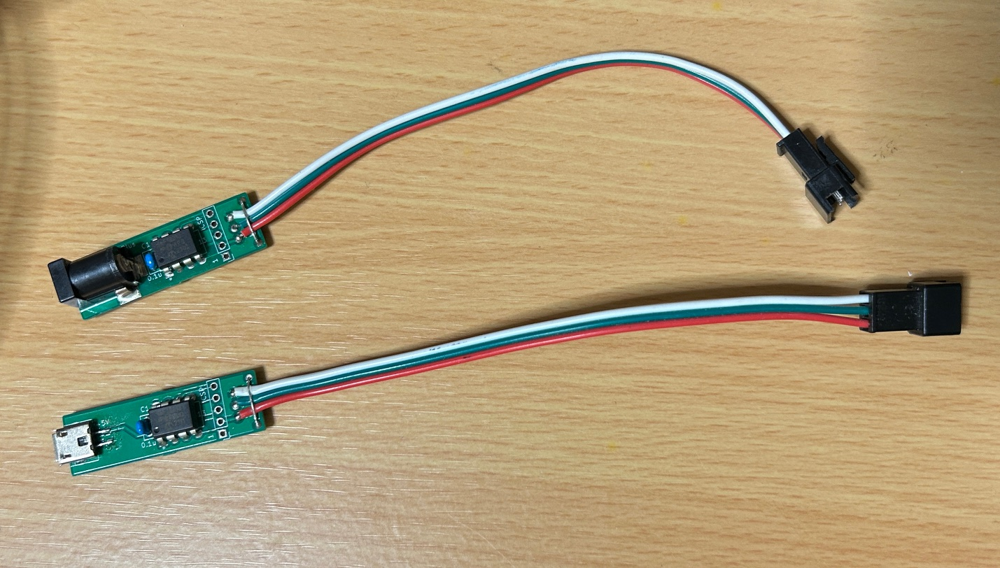

# PIC16F18313用
プリント基板を入手された方はマイコンの向きに注意して写真のように組み立ててください。LEDテープ用の3ピンの端子付きケーブルを使うと便利です。プログラムの書き込みは、PICkitなどを使ってICSP端子から行ってください。その際、1ピン～5ピンだけを使います。6ピンは使わないのでスルーホールはありません。  
  
## 公開プログラム
bouncingLED.hexを書き込んでください。ソースプログラムも公開していますので、自由に変更して使ってください。